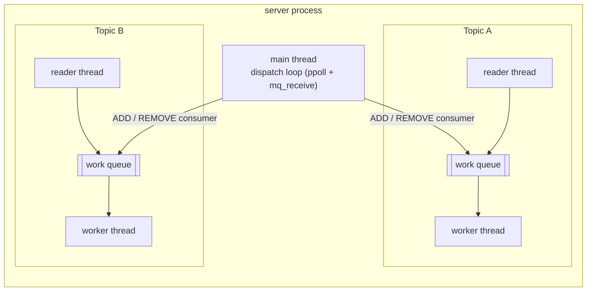
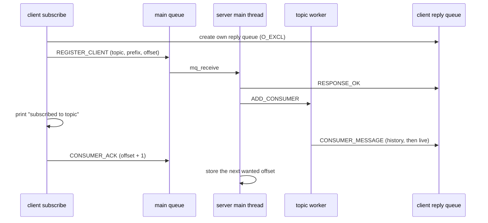
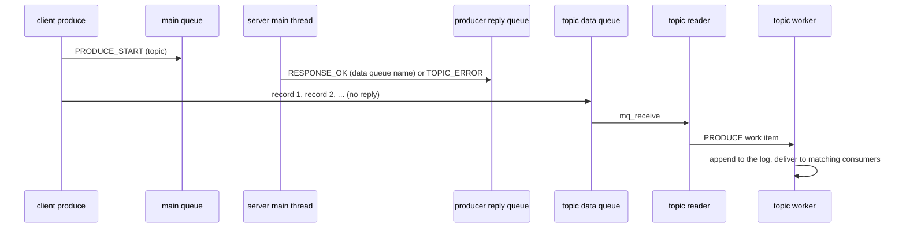
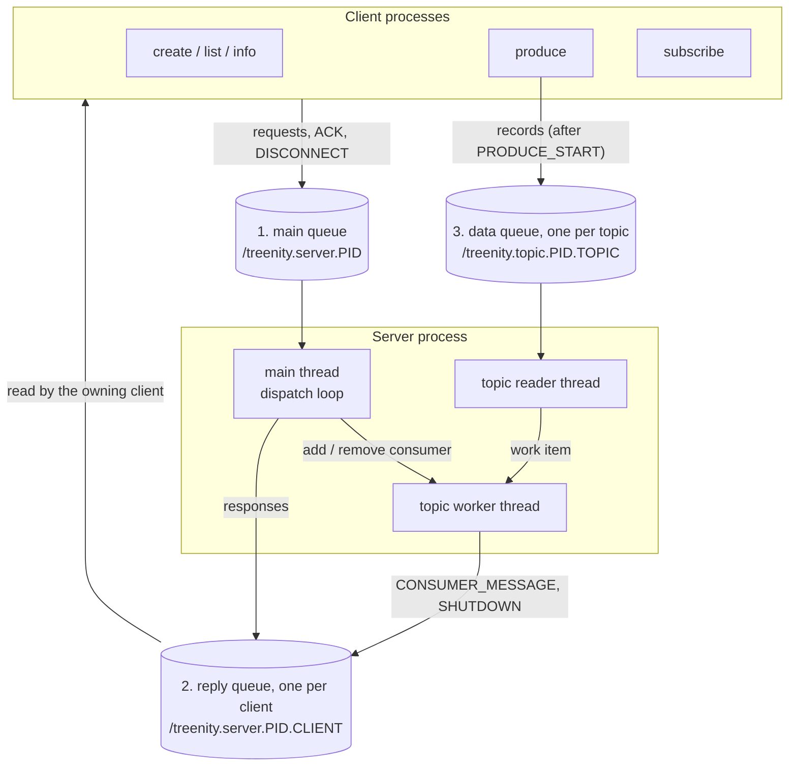

*This project has been created as part of the 42 curriculum by mtaranti, jiezhang.*

# treenity — Message Queue System

## Description

treenity is a small message queue broker in the spirit of Kafka. Producers
publish `key:value` messages to named **topics**. Consumers **subscribe** to a
topic, optionally filtering by key prefix, and receive the messages
asynchronously. Every message gets an increasing 32-bit **offset**, and a
consumer can resume from the offset it committed last time or jump to any
offset it asks for.

The goal of the project is to practise inter-process communication, shared
data structures, concurrency and graceful shutdown in C++17 on Linux, using
POSIX message queues as the only transport.

It ships as two executables built from one Makefile:

- **`server`** keeps every topic's message log and every consumer index in
  memory, accepts management requests, routes produced records to the
  matching subscribers and persists nothing to disk. The data lives as long
  as the process.
- **`client`** is one binary with five subcommands: `create`, `list`,
  `produce`, `subscribe` and `info`.

Key features:

- Topic creation and listing.
- Text (`key:body`) and raw binary message formats.
- Prefix-filtered subscriptions, served by a trie.
- Offset tracking: a returning subscriber resumes where it stopped, or starts
  at an explicit `--offset`.
- Several servers can run side by side, because every IPC name contains the
  server's PID.
- One reader thread and one worker thread per topic, so a slow topic does not
  block the others.
- Graceful shutdown on `SIGINT` / `SIGTERM`: every subscriber is told to
  leave, and the server waits a bounded time for them to disconnect.
- Hand-written data structures: a hash map for the client index and a trie
  for prefix matching. `std::unordered_map` is not used anywhere.

## Instructions

### Prerequisites

- Linux. POSIX message queues (`mqueue.h`) are not available on macOS or
  Windows.
- `c++` / `g++` with C++17 support, and `make`.
- `libgtest-dev` and `pkg-config`, only for `make test`.

The `.devcontainer/devcontainer.json` (Ubuntu 24.04) installs all of the
above if you open the project in a dev container.

### Build

```sh
make        # builds ./server and ./client
make re     # clean + build
make clean  # removes object files and binaries
make test   # builds and runs the unit tests
```

The code is compiled with `-std=c++17 -Wall -Wextra -Wshadow -pthread`.

### Run

Start the server. It prints its IPC identifier on stdout, then waits:

```sh
./server &
# /treenity.server.1337
```

Use that identifier as the first argument of every client command:

```sh
./client /treenity.server.1337 create user_events
# topic created

./client /treenity.server.1337 list
# user_events

./client /treenity.server.1337 subscribe user_events client0 --prefix user.create &
# subscribed to user_events

./client /treenity.server.1337 produce user_events
# type one message per line, then Ctrl+D:
# user.create:{"user":"reach","age":25}
# user.update:{"user":"norminet","age":42}
# the subscriber prints only: user.create:{"user":"reach","age":25}

./client /treenity.server.1337 info client0
# {"client":"client0","topic":"user_events","offset":1,"prefix":"user.create","ipc":"/treenity.server.1337.client0"}
```

Stop the server with `Ctrl+C` or `kill -INT <pid>` (or `SIGTERM`). Subscribers
are told to disconnect and exit with code 0.

### Command reference

| Command | What it does | Output on stdout |
|---|---|---|
| `client <id> create <topic>` | Creates a topic. | `topic created` |
| `client <id> list` | Lists the topics. | Comma-separated names |
| `client <id> produce <topic> [--raw]` | Reads messages from stdin and sends them. | Nothing |
| `client <id> subscribe <topic> <name> [--prefix <p>] [--offset <n>] [--raw]` | Subscribes and prints matching messages until stopped. | `subscribed to <topic>`, then the messages |
| `client <id> info <name>` | Shows what the server knows about a subscriber. | One JSON object |

Rules for names: client names, subscriber names and topic names must match
`^[a-zA-Z0-9_.-]{1,32}$`. A prefix is at most 32 characters. A key plus its
value may not exceed 1024 bytes.

### Message formats

**Text mode (default).** One message per line, `key:body`. The key ends at the
first `:`; the body is everything after it. The subscriber prints the same
`key:body` form.

**Raw mode (`--raw`).** Binary, little-endian, no separators and no padding.

```
Producer input:     [keysize:int32][key bytes][valuesize:int32][value bytes] ...
Subscriber output:  [offset:int32][keysize:int32][key bytes][valuesize:int32][value bytes] ...
```

End of input must fall on a record boundary. A partial record at the end of
the input is a producer error (message on stderr, exit code 1). A record whose
key plus value is larger than 1024 bytes is refused before anything is
allocated.

### Offsets

- The offset is a 32-bit counter kept per topic, starting at 0.
- A subscriber commits by acknowledging each message. The stored offset is
  always the **next offset the subscriber wants**: after processing the
  message at offset N it commits N + 1. `info` shows this stored value.
- Where a subscription starts:
  1. if `--offset` is given, there; otherwise
  2. if the same subscriber name comes back to the same topic, at its stored
     offset; otherwise
  3. at offset 0, which replays the whole history of the topic.
- A returning subscriber may change topic or prefix. A returning subscriber
  that does not pass `--prefix` receives every message (no filter).
- Two subscribers with the same name cannot be active at the same time.

### Exit codes

| Code | Meaning | Examples |
|---|---|---|
| 0 | Success | |
| 1 | General error | bad arguments, invalid name, unreachable IPC identifier, partial raw record |
| 2 | Topic or client error | topic not found, topic already exists, client not found, duplicate subscriber name |
| 3 | IPC communication error | the server went away in the middle of a request |

If several conditions apply, the precedence is 1, then 3, then 2.
Human-readable messages go to stderr; only the specified outputs go to stdout.

## Architecture

### Processes and threads



- The **main thread** runs a single dispatch loop. It waits with `ppoll` on
  the main request queue, reads each request with `mq_receive` and calls the
  handler for it (`create`, `list`, `register`, `produce-start`, `info`,
  `ack`, `disconnect`). Topic threads never read the main queue.
- Every **topic** owns two threads:
  - a **reader** thread, blocked in `mq_receive` on the topic's data queue.
    It turns each incoming record into a `PRODUCE` work item;
  - a **worker** thread, which takes work items from a `std::queue` one at a
    time (`PRODUCE`, `ADD_CONSUMER`, `REMOVE_CONSUMER`). The queue is guarded
    by a `std::mutex` and a `std::condition_variable` with a predicate, so
    spurious wake-ups and early notifications are harmless.
- All changes to a topic (appending to the log, adding or removing a
  consumer, replaying history, delivering) happen in its worker thread, one
  after another. This is what keeps replay and live delivery consistent: a
  new consumer is replayed from its start offset up to the end of the log and
  added to the index in a single work item, so no message can be missed or
  delivered twice between the two.

### Synchronization

| Shared state | Who touches it | Protection |
|---|---|---|
| Work queue of a topic | reader, main thread, worker | `std::mutex` + `std::condition_variable` |
| Message log of a topic | worker (writes and delivery reads), `size()`/`get()` callers | `std::shared_mutex` (shared for reads, unique for `append`). The next offset is simply `log_.size()`. |
| Consumer index of a topic (trie) | worker only | none needed, single owner |
| Client registry (hash map) | main thread (writes), `info` reads | `std::shared_mutex` inside `ClientRegistry` |
| Table of topics (`std::map`) | main thread only | none needed, single owner |
| Shutdown flag | signal handler, main thread | `volatile sig_atomic_t` |

Topic threads block `SIGINT` and `SIGTERM`, so signals are always handled by
the main thread.

### Message flows

**Subscribe, delivery and acknowledgement.**



The server sends `RESPONSE_OK` **before** it replays any history. Both travel
through the same reply queue, so the client always reads the answer to its
request first, and "subscribed to ..." is always printed before the first
message.

**Produce.**



The handshake is how a producer finds out that a topic does not exist (exit
code 2) before sending anything. After it, records go straight to the topic's
own queue and never use the main queue again.

### Ordering

- Records of one producer are stored in the order the server receives them,
  because one reader and one worker handle a topic in FIFO order.
- There is no ordering guarantee between different producers.
- A consumer receives messages in offset order.

### Graceful shutdown

On `SIGINT` or `SIGTERM`:

1. The signal handler only sets a `volatile sig_atomic_t` flag. The main
   thread blocks both signals from the start and passes the original signal
   mask to `ppoll`. A signal that arrives between "is shutdown requested?" and
   the blocking wait stays pending and interrupts the wait at once, so it is
   never lost.
2. The server stops every topic: the reader is woken with a poison pill (a
   record with an impossible key size), the worker drains the work that is
   already queued, and the topic sends a `SHUTDOWN` message to every
   subscribed consumer through its reply queue.
3. The server then keeps serving **only `CONSUMER_ACK` and `DISCONNECT`** on
   the main queue. Any other request gets an `IPC_ERROR` reply
   ("server is shutting down").
4. When a subscriber reads `SHUTDOWN`, it sends a last acknowledgement and a
   `DISCONNECT`, removes its reply queue and exits with code 0.
5. The server exits when every consumer has disconnected, or after a 4 second
   soft deadline. `alarm(5)` is a hard stop (`SIGALRM` handler calling
   `_exit`), which gives the 5 second limit of the subject. The server always
   unlinks the main queue and every topic queue on the way out.

A subscriber that receives `SIGINT` or `SIGTERM` itself leaves the same way:
its blocked `mq_receive` is interrupted (the handler is installed without
`SA_RESTART`), it sends `DISCONNECT`, cleans up and exits with code 0.

Why a sentinel: a consumer's reply queue is one-way (server to client), so
closing it on the server side does not wake a client that is blocked reading
it. An explicit `SHUTDOWN` message is the one thing that always does.

## IPC Choice

**Mechanism: POSIX message queues** (`mq_open`, `mq_send`, `mq_receive`,
`mq_unlink`).

Why not the alternatives:

- **Named pipes (FIFOs)** are byte streams. Messages would need our own framing
  on top, and several writers can interleave partial writes. A message queue
  hands the reader exactly one whole message per call, which matches the
  "one struct per message" protocol.
- **System V message queues** have no file descriptor, so they cannot be
  waited on together with a signal mask. A POSIX queue descriptor can be given
  to `poll` / `ppoll`, which is what the server's dispatch loop does. System V
  queues are also identified by a numeric key from `ftok()`, while POSIX queues
  have readable names, which are easy to print, to derive and to debug.

Limits we accept: the queue sizes are fixed when a queue is created
(10 messages per queue, 300 bytes per request, 1200 bytes per message to a
client, 1100 bytes per record to a topic), messages are copied through the
kernel, and the names must be a single slash followed by a name without further
slashes. That is why our identifier looks like `/treenity.server.<pid>` and not
like the `/tmp/...` example in the subject, which is only an example.

### Bidirectional communication

A POSIX message queue is one-way: the process that opens it with `O_RDONLY` is
its only reader, and everybody else opens the same name `O_WRONLY`. To get
two-way conversations, treenity uses **three kinds of queues**. Every name
contains the server PID, so several servers do not interfere.

| # | Queue | Name | Created and removed by | Read by | Written by | Carries |
|---|-------|------|------------------------|---------|------------|---------|
| 1 | Main request queue | `/treenity.server.<pid>` | the server | the server (main thread) | every client | `CREATE_TOPIC`, `LIST_TOPICS`, `REGISTER_CLIENT`, `PRODUCE_START`, `INFO`, `CONSUMER_ACK`, `DISCONNECT` |
| 2 | Reply queue, one per client | `/treenity.server.<pid>.<client_id>` | the client | the client | the server (main thread for replies, topic worker for deliveries) | `RESPONSE_OK`, `RESPONSE_ERROR`, `CONSUMER_MESSAGE`, `SHUTDOWN` |
| 3 | Data queue, one per topic | `/treenity.topic.<pid>.<topic>` | the `Topic` object | the topic's reader thread | producers | produced records (key size, value size, bytes) |



An arrow into a queue is an `mq_send`, an arrow out of it is an `mq_receive`.
Each queue has exactly one reader. That is what makes the one-way queues
usable for two-way conversations: a client sends a request on queue 1 and
always waits for the answer on its own queue 2.

Design choices behind the three queues:

- **Every client owns its reply queue**, and the client is the one that
  unlinks it. The server only opens it for writing. The queue is created with
  `O_EXCL`, so a second client with the same name cannot take over or delete
  the queue of the first one; it simply fails with "duplicate client name".
- **Producers get a separate data queue per topic.** A fast producer then never
  competes with management requests on the main queue, and each topic's reader
  thread only sees its own stream.
- **Requests carry a `request_id`**, and responses echo it. Consumer messages
  are asynchronous events and do not belong to any request.
- **The server never trusts IPC fields.** Strings are read with `strnlen`,
  client and topic names are validated, sizes are checked before any copy, and
  a request with an invalid client name is dropped because there is no valid
  queue to answer on.
- **The server writes to client queues without blocking indefinitely.** Replies
  from the main thread use a non-blocking send, so one full queue can never
  freeze the dispatch loop. Message deliveries from a topic worker wait up to
  200 ms for room in a full queue (`mq_timedsend`) and then drop that message
  with a log line; the wait only delays that topic's worker. The `SHUTDOWN`
  sentinel is sent without waiting.

## Data Structures

### Client registry: hash map (`src/server/HashMap.hpp`)

The server indexes client metadata (client id, topic, current offset, key
prefix, IPC path, active flag) in a hash map written for this project. No
`std::unordered_map` is involved.

- **Collision resolution: separate chaining.** Each bucket is a singly linked
  list of nodes owned by `std::unique_ptr<Node>`. New nodes are inserted at the
  head of the chain, which is O(1) and does not need a walk to the tail. The
  order inside a bucket does not matter.
- **Hash function: FNV-1a.** It is a few lines long, fast, and spreads short
  ASCII keys such as client ids and topic names well enough. A cryptographic
  hash would only add cost.
- **Resizing.** The bucket count doubles when an insert would push the load
  factor (entries / buckets) above 0.75. Rehashing recomputes each node's
  bucket index (`hash % bucket_count`), because the same hash gives a different
  index with a different bucket count. Lookups stay O(1) on average.
- **Erase.** The code walks the chain with a pointer to the `unique_ptr` slot
  that holds the current node. Re-pointing that slot removes a node at the head,
  in the middle or at the tail with the same code.
- **Header-only template.** `HashMap<Key, Value, Hash>` is a template, so its
  full definition has to be visible where it is instantiated.
- **Thread safety.** `ClientRegistry` wraps the map in a `std::shared_mutex`:
  `get` / `exists` take a shared lock so concurrent `info` requests do not block
  each other, while `insert` / `upsert` / `set_offset` / `set_active` / `remove`
  take a unique lock. `get` returns a copy, which stays valid after the lock is
  released.
- **Worst case.** If every key collided, a lookup would walk one chain of n
  nodes, O(n). The tests force exactly that case with a constant hash and check
  that the map is still correct.

### Prefix matching: trie (`src/server/PrefixIndex.hpp`)

Each topic keeps its consumers in a **trie (prefix tree)** indexed by key
prefix.

- A consumer registered with the prefix `"user"` is stored on the node reached
  by walking `u`, `s`, `e`, `r` from the root.
- `match(key)` walks the trie one character of the **message key** at a time and
  collects the consumers stored on every node it passes. For the key
  `user.login` and consumers on `user` and `user.l`, both match; a consumer on
  `admin` does not. The cost is O(length of the key), independent of how many
  consumers exist. The walk stops as soon as a character has no child.
- **Empty prefix.** A consumer with no prefix matches everything, so it never
  enters the trie. It is kept in a separate list that is added to every result
  directly, with no traversal ("Direct Addition" in the subject).
- **Several consumers on the same prefix** are all stored on the same node.
- The trie stores only client ids; the full consumer information (prefix, IPC
  path) lives in a hash map keyed by client id, which is the hand-written
  `HashMap` above. Child links use `std::map<char, std::unique_ptr<TrieNode>>`.
- **`add`** first removes any previous registration of the same client, so
  re-subscribing with a different prefix never leaves the client in two places.
  **`remove`** copies the prefix before erasing the stored entry, because the
  entry owns the string. **`all()`** walks the whole trie and the empty-prefix
  list; the shutdown path uses it to notify every consumer.
- Nodes are not pruned after a removal. Empty branches stay in memory, which is
  acceptable for the sizes involved and keeps the code simple.

Why a trie, compared with the alternatives:

| Structure | Cost per message | Remark |
|---|---|---|
| Scan every consumer | O(consumers × prefix length) | simple, but slow with many consumers |
| Hash table of prefixes | one lookup per prefix length of the key, each hashing a growing string | works, but hashes O(k²) bytes per key |
| Balanced tree (AVL / red-black) | O(log n × k) comparisons | awkward for "all stored prefixes of this key" |
| **Trie** | **O(k)** | one pass; shared prefixes share storage; all matching prefixes are found on the way |

(n = number of consumers, k = length of the message key.)

## Testing

The prefix-matching tests use **Google Test** and live in `tests/`.
`make test` compiles every file under `tests/` against gtest (found with
`pkg-config gtest gtest_main`), links the result with the real
`src/server/PrefixIndex.cpp` (nothing is mocked), and runs the resulting
`test_runner`. The target fails if a test fails, so it can be used in a script
(`make test && echo ok`).

```sh
make test
```

`libgtest-dev` and `pkg-config` must be installed; the dev container does it.

**`tests/PrefixIndexTest.cpp`** (14 tests):

- empty index matches nothing, and `all()` is empty;
- exact match (`user` against `user`);
- prefix match (`user` against `user.login`);
- no match (`user` against `admin`), including a case that shares a first
  letter but diverges before the end of the prefix;
- empty prefix matches every key, and an empty key matches only empty and
  wildcard prefixes;
- several consumers sharing one prefix;
- one key matching several nested prefixes (`a`, `ab`, `abc` for `abcd`, but not
  `abd`);
- removal: it stops future matches, it is safe for an unknown client, and it only
  affects the targeted client;
- re-adding a client replaces its previous prefix;
- `all()` returns every consumer regardless of prefix.

**`tests/HashMapTest.cpp`** (10 tests), for the client index:

- insert, find, find of a missing key;
- duplicate insert is rejected and keeps the original value;
- upsert inserts when absent and overwrites when present;
- erase, and erase of an unknown key;
- a `ConstantHash` that forces every key into one bucket: all keys are still
  found, and erasing one key removes only that key;
- growth under load: many inserts trigger rehashing and every key stays findable.

### End-to-end checks

The unit tests do not start processes, so the whole system was also checked by
hand against the real binaries. The main scenario was also run once with the
server and client built with `-fsanitize=address,undefined` and once with
`-fsanitize=thread`, without any report. The scenarios:

- the example of the subject: create, subscribe with a prefix, produce four
  messages, `info` shows offset 4;
- error codes: duplicate topic (2), unknown client (2), unknown topic on produce
  and on subscribe (2), invalid IPC identifier (1), invalid client name (1),
  duplicate subscriber name (2);
- a duplicate subscriber is refused without disturbing the running one;
- resume: a returning subscriber continues from its stored offset, and
  `--offset` jumps to an explicit one;
- replaying 200 messages to a new subscriber delivers all 200; replaying 1000
  large messages to a deliberately slow reader delivers about 990 (it was 76
  before deliveries were allowed to wait for room in the queue);
- raw mode: valid records, an oversized key or value (exit 1 without a
  crash), and a truncated record (exit 1);
- shutdown with `SIGINT`: subscribers exit with code 0, the server exits, and
  no queue is left behind in `/dev/mqueue`.

## Project layout

```
.
├── Makefile                  all, clean, re, test
├── include/
│   └── ipc_protocol.h        message structs, limits, queue name helpers
├── src/
│   ├── server/
│   │   ├── main.cpp          starts the server
│   │   ├── Server.*          dispatch loop, request handlers, shutdown
│   │   ├── Topic.*           message log, reader and worker threads
│   │   ├── ClientRegistry.*  client metadata behind a shared_mutex
│   │   ├── HashMap.hpp       hand-written chained hash map (template)
│   │   └── PrefixIndex.*     trie of consumer prefixes
│   └── client/
│       ├── main.cpp          argument parsing and dispatch
│       ├── IpcClient.*       the client's reply queue and the main queue
│       ├── CreateTopic.cpp, ListTopics.cpp, Info.cpp, Produce.cpp, Subscribe.cpp
│       ├── Codec.*           little-endian encoding, exact reads, line splitting
│       └── Validation.hpp, Ephemeral.hpp, Errors.hpp, Fields.hpp
├── tests/
│   ├── PrefixIndexTest.cpp
│   └── HashMapTest.cpp
└── treenity_technical_notes.md   role split and the frozen IPC contract
```

## Known limitations

- **Slow consumers can lose messages.** A delivery waits at most 200 ms for room
  in a consumer's queue (10 slots) and is then dropped. This is much better than
  dropping at once, but a consumer that stays stuck still loses messages and
  slows down its own topic.
- **A crashed subscriber stays "active".** If a subscriber dies without
  sending `DISCONNECT`, its name is refused as a duplicate until the server
  restarts, and its reply queue is left behind (the server never unlinks it).
  A shutdown with such a subscriber waits for the 4 second soft deadline.
- **The log is not persistent and not bounded.** Everything is in memory and
  nothing is ever removed.
- **`list` is limited to 512 bytes** of topic names (whole names only).
- **A client cannot detect that the server was killed** while it is waiting for
  a message from a subscription. Normal shutdown is handled through `SHUTDOWN`.
- **The trie is not pruned** after removals.
- **The IPC identifier** has the form `/treenity.server.<pid>` and not the
  `/tmp/...` form of the subject's example, because POSIX queue names cannot
  contain further slashes.

## Resources

- POSIX message queues: `man 7 mq_overview`, `man 3 mq_open`, `man 3 mq_send`,
  `man 3 mq_timedsend`, `man 3 mq_receive`
- Signals and waiting: `man 2 ppoll`, `man 2 sigaction`, `man 7 signal-safety`,
  `man 2 alarm`
- C++ concurrency: `std::thread`, `std::mutex`, `std::shared_mutex`,
  `std::condition_variable` on <https://en.cppreference.com>
- FNV-1a hash: <https://www.isthe.com/chongo/tech/comp/fnv/>
- Hash tables and tries: *Introduction to Algorithms* (CLRS), the chapters on
  hash tables, and any reference on prefix trees
- Google Test: <https://google.github.io/googletest/>
- Conventional Commits: <https://www.conventionalcommits.org/>

### How AI was used

**AI usage (`mtaranti`).** Claude (Anthropic) was used by `mtaranti` for:
implementing the entire `client` executable (`src/client/`) against the
`ipc_protocol.h` contract and the behavioural notes left in
`treenity_technical_notes.md`; replacing the placeholder linear-scan
`PrefixIndex` with the trie implementation described above; writing the `gtest`
suite under `tests/`; wiring `make test` and the devcontainer's `libgtest-dev`
dependency; and drafting the first version of this README. Every piece was
reviewed line by line and validated with end-to-end integration tests run against
the real `server` binary (create / list / produce / subscribe / info, prefix
filtering, offset resume, raw binary mode, and graceful shutdown via `SIGINT`)
before being committed. See the git history for the resulting commits.

**AI usage (`jiezhang`).** Claude (Anthropic) was used as a tutor and code
reviewer for the server side (`Server`, `Topic`, the hash map behind
`ClientRegistry`, the shutdown sequence), for which `jiezhang` had no prior
C++ experience. Claude explained the design and the C++ and POSIX concepts,
proposed code and asked comprehension questions; `jiezhang` typed the code,
built it, tested it with small throw-away programs and committed each step on
its own branch. At the end, Claude helped to review the whole project against
the subject and to test it end to end; the issues found were fixed and tested
by `jiezhang` on separate branches. Claude also helped to write and draw the
Architecture, IPC Choice and Data Structures sections of this README, which
`jiezhang` checked against the code.
